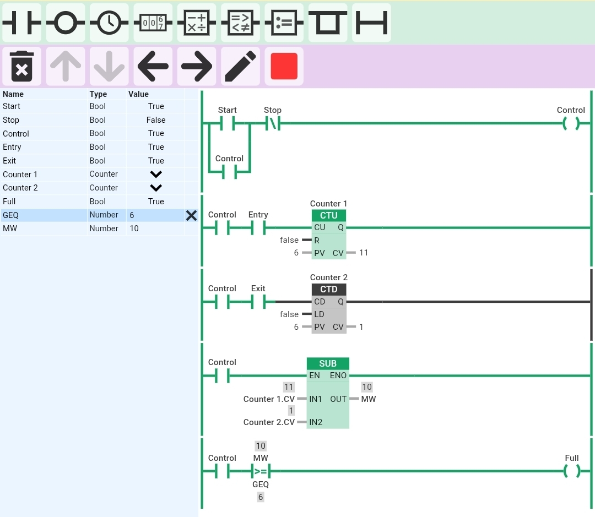

Car Parking System

Description

This project simulates a PLC-based car parking system using ladder logic to count vehicles entering and exiting the parking area and indicate when parking is full.

Inputs

- Start (I0.0)
- Stop (I0.1)
- Entry Sensor
- Exit Sensor

Outputs

- Control
- Full Indicator

Features

- Start/Stop latch control
- CTU counter for vehicle entry
- CTD counter for vehicle exit
- Occupancy calculation using subtraction (Entry - Exit)
- Full parking indication when capacity reaches 6 vehicles

Logic Used

- SUB block for occupied vehicle count
- Comparator (>= 6) for full parking detection

Capacity

- Maximum Parking Slots = 6

Tool Used

- Online PLC Simulator

Output

