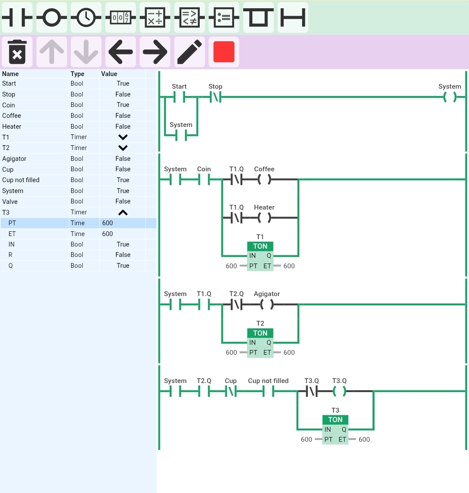

Coffee Vending Machine

Description

This project simulates an automatic coffee vending sequence using PLC ladder logic with timers, sensor conditions and sequential operation for coffee preparation.

Inputs

- Start
- Stop
- Coin Sensor
- Cup Present Sensor
- Cup Not Filled Sensor

Outputs

- Coffee Dispenser
- Heater
- Agitator
- Filling Valve

Features

- Start/Stop latch control
- Coin-based operation start
- Timer-controlled heating process
- Automatic mixing using agitator
- Sensor-based cup filling sequence
- Sequential coffee preparation and dispensing

Timers

- T1 = Heating/Brewing Time
- T2 = Mixing Time
- T3 = Filling Time

Tool Used

- Online PLC Simulator

Output

