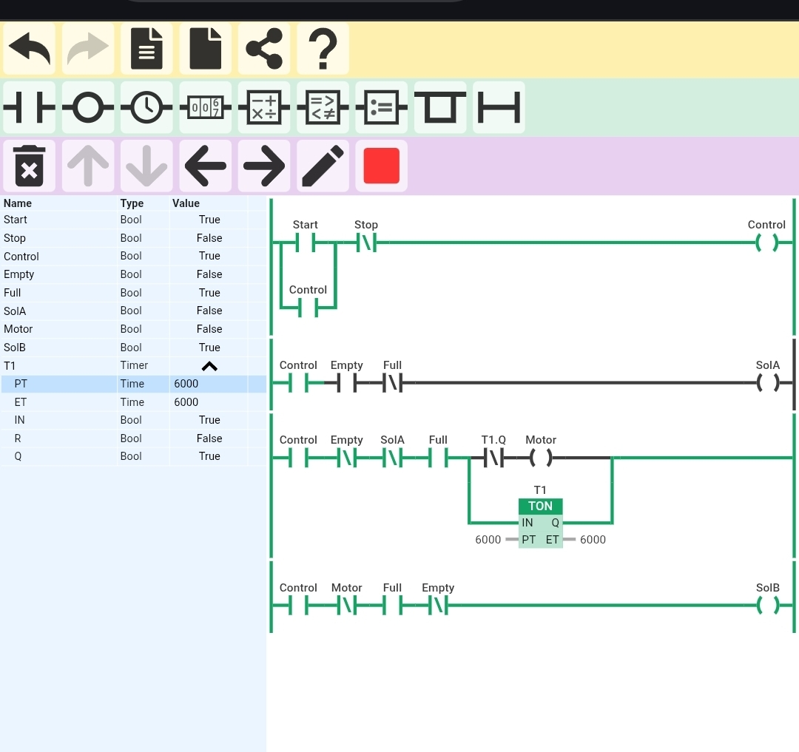

Tank Level Control System

Description

This project simulates an automatic tank filling system using PLC ladder logic.

Inputs

- Start (I0.0)
- Stop (I0.1)
- Empty Sensor
- Full Sensor

Outputs

- Control
- SolA (Filling Valve)
- Motor
- SolB

Features

- Start/Stop latch control
- When tank is empty, SolA opens (filling starts)
- Timer-based motor control (TON)
- When tank is full, SolB opens
- Sensor-based operation

Timer

- TON (T1) = 6000 ms

Tool Used

- Online PLC Simulator

Output

