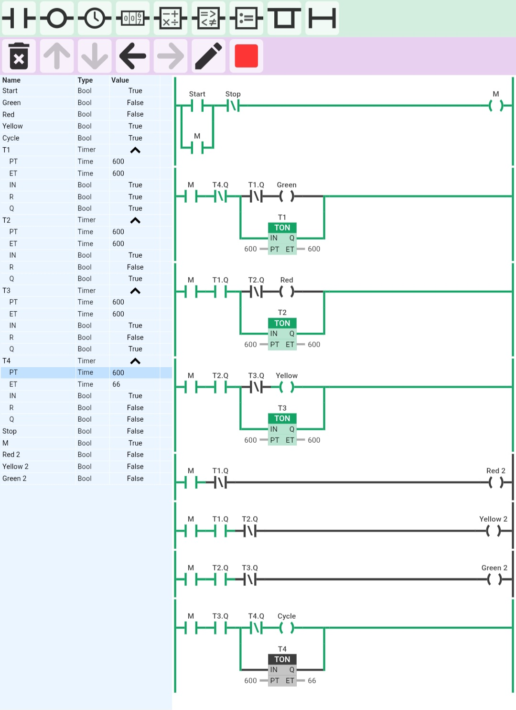

Two-Way Traffic Light Control

Description

This project simulates a two-way traffic signal system using PLC ladder logic with timers and cyclic sequencing.

Inputs

- Start
- Stop

Outputs

Road 1:
- Green
- Yellow
- Red

Road 2:
- Green 2
- Yellow 2
- Red 2

- Cycle

Features

- Start/Stop latch control
- Timer-based traffic signal sequencing
- Two-way road interlocking
- Automatic cyclic repetition
- Opposite-road signal coordination

Timers

- T1 = Road 1 Green duration
- T2 = Road 1 Red / Road 2 transition
- T3 = Road 2 Green duration
- T4 = Cycle Completion / Reset

Tool Used

- Online PLC Simulator

Output

